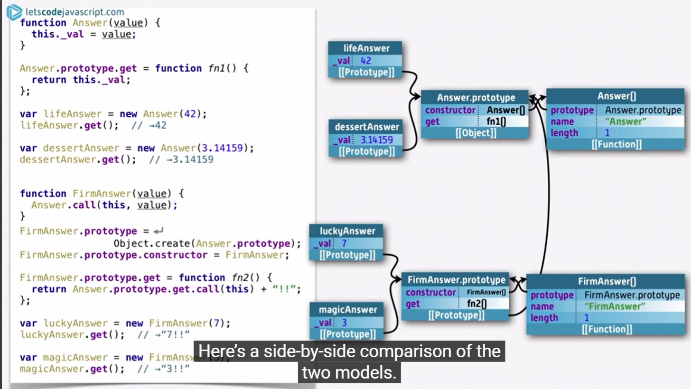
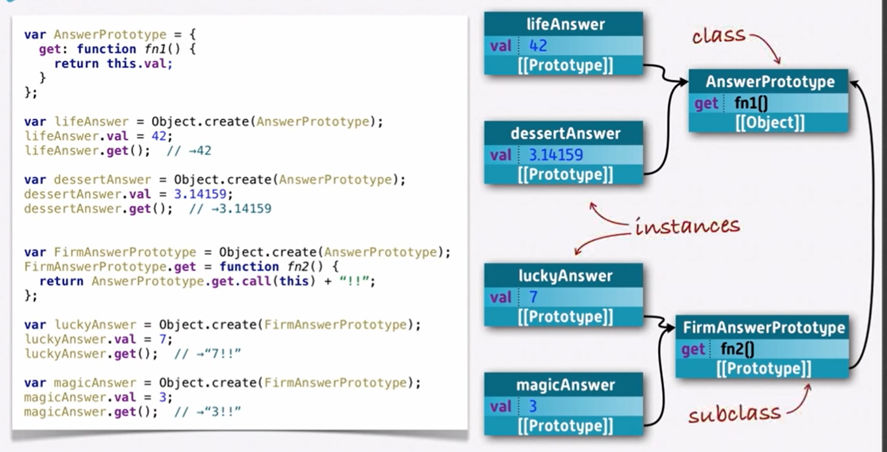
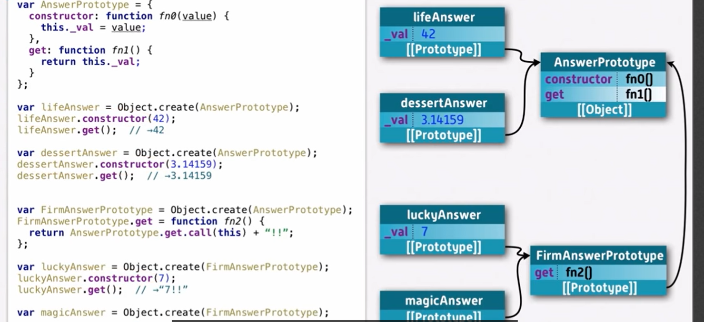
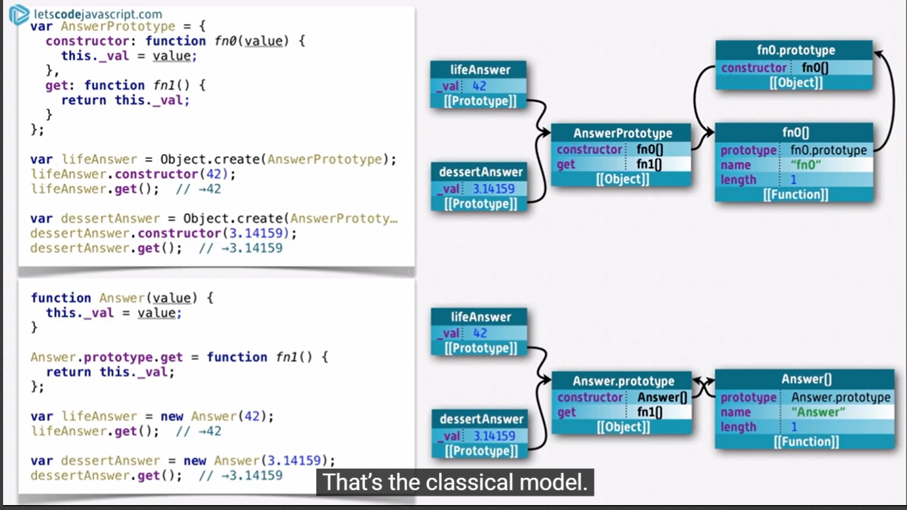
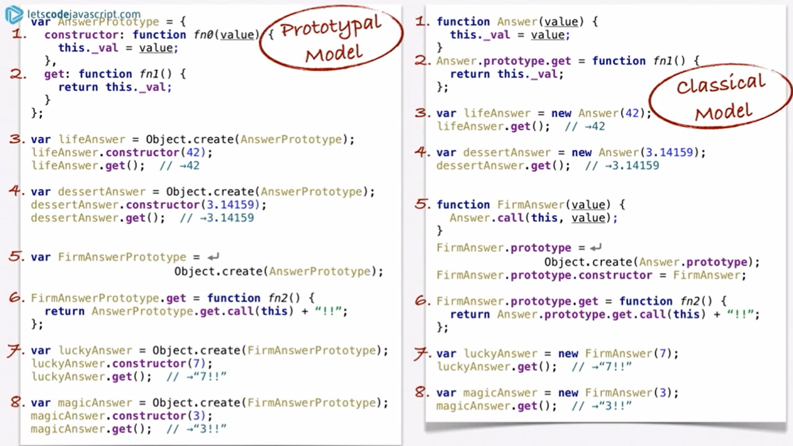
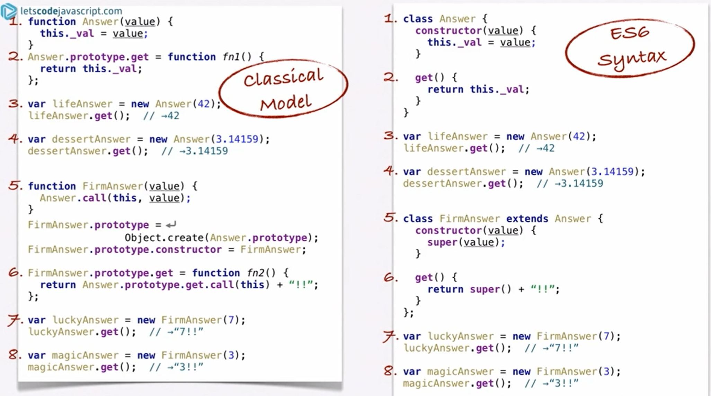

#### **JavaScript What I learned**

**Object**

```javascript
var objectName = {
  member1Name : member1Value,
  member2Name : member2Value,
  member3Name : member3Value,
  functionName: function(){
      #some codes
  }
}
```

- **dot notation**

```javascript
object.member
```

- **bracket notation**

```javascript
object['member']
```

点表示法只能接受字面量的成员的名字，不接受变量作为名字。使用bracket notation可以动态的为对象添加成员

- **this**
  - this指向了代码运行时所在的对象
- **Constructor**
  - constructor的name首字母大写

```javascript
# create a constructor for person
function Person(name,age) {
  this.name = name;
  this.age = age;
  this.greeting = function() {
    alert('Hi! I\'m ' + this.name + '.');
  };
}
#create an object by constructor
let person1 = new Person("ma",18);
```

- Object 方法，通过自带funct快速创建object

```javascript
let person1 = new object();
#or you can add some detail when creating
var person2 = new Object({
  name : 'Chris',
  age : 38,
  greeting : function() {
    alert('Hi! I\'m ' + this.name + '.');
  }
});
#and use create() to copy and inherit
let person3 = Object.create(person2);
```


- **Prototype 对象原型** 【need more study
  - JS中，object 不会 **copy** method sand members from its prototype, 而是**derived** from the prototype property on prototype's constructor。原型链中的方法和属性**没有**被复制到其他对象——它们被访问需要通过前面所说的“原型链”的方式。


- standard code

```javascript
function MyClass(){
	#...
}
MyClass.protoype.method = function(){
	#...
}

#inheritance
function MySubClass(value){
    MyClass.call(this,value);	#this creates independent MySubClass prototype, but we 									#need to extend its prototype from its parent
}
MySubClass.prototype = Object.create(MyClass.prototype);# this extends the parent 																# prototype
MySubClass.prototype.constructor = MySubClass;
MySubClass.prototype.method = function(){
    MyClass.prototype.method.call(this);
}
```







two steps to create an instance

- create the object by extending its class's prototype
- initialize the instance's data by initialization function constructor

instances are about data, prototype are about methods --- the classes are about methods




*"_varName" means the var is private. 

- **classical model with "new" keywords**
  - when create the class: 
    - create the constructor (prototype)
    - add methods/data to its constructor prototype





|                |                                                              |                                                              |
| -------------- | ------------------------------------------------------------ | ------------------------------------------------------------ |
| create a class | constructor, member, method                                  | create a constructor and add methods (and member?) to its prototype |
| new an object  | new constructor and add method....again                      | "new" keyword helps to create a new constructor, **obj's prototype ==class.prototype** |
| inheritance    | create a new subclass and update/add methods with parent.call(this) | new a prototype from parents and update its prototype.constructor and prototype.methods. |

**obj.prototype**: obj's prototype property !== **obj's prototype** : 

prototype chain





**Json**

- get json
  1. 使用XHR (XMLHTTPRequest API)

```javascript
//get json by XHR
var requestURL = 'https://mdn.github.io/learning-area/javascript/oojs/json/superheroes.json';
var request = new XMLHttpRequest();     //XHR API
request.open('GET', requestURL);
request.responseType = 'json';

request.send();
request.onload = function() {
var superHeroes = request.response;
populateHeader(superHeroes);
showHeroes(superHeroes);
}    

function populateHeader(jsonObj) {}
```

1. 手动字符串 <===>json
   - `parse()`: 以文本字符串形式接受JSON对象作为参数，并返回相应的对象。
   - `stringify()`: 接收一个对象作为参数，返回一个对应的JSON字符串。

```javascript
request.open('GET', requestURL);
request.responseType = 'text'; // now we're getting a string!
request.send();

request.onload = function() {
  var superHeroesText = request.response; // get the string from the response
  var superHeroes = JSON.parse(superHeroesText); // convert it to an object
  populateHeader(superHeroes);
  showHeroes(superHeroes);
}

let myJson= {"name":"ma","age":"18"};
myString =JSON.stringfy(myJson);
```

