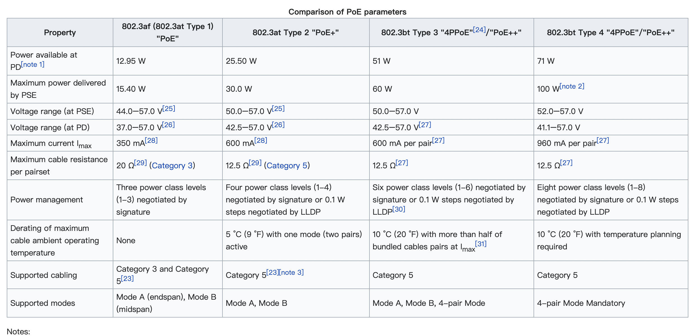

cloudtracer

跟踪网络性能：带宽，Jitter, latency（延时稳定，抖动丢包率就小）, 


VRF: vxlan大局域网分为小局域网，把端口放到不同的VRF, 相同VRF的端口才能路由。不同vrf的相同ip不会冲突


telemetry：

1，sytem: 收集error，event，

2，inband：经过路径，交换机port


**组播：**

几个interface，从一个进来送到其他所有interface

组播ip，source ip, 


mac address is for phsycal device

ip address is for connection


**ARP table (**Address Resolution Protocol)  translation between Mac addr and IP addr. 当IP数据包通过以太网设备传播时，以太网设备无法识别ip地址(以太网设备通过mac addr传输数据包)，ARP table从中实现转换。ARP table的格式通常为

第一行：source/destination ip address

第二行：存储该ip addr的mac addr

第三行：网卡接口


**NDP(Neighbor Discovery Protocol),** IPv6地址的自动分配。


**LAN:**  a collection of devices connected together in one phsycial location.

- cables
- access points
- switches
- routers
- other components that enable devices to connect to internal severs and other LANs

types of LANs:

- client/server Lan: The server manages many stuffs including traffic managment. The client accesses and runs the app on internet and connect to the sever with cables or wireless connections. CS Lan can handles the heavy workloads
- peer-to-peer Lan: each device shares equally in the functioning in the network so cannot handles heavy workload.

**VLAN(Virtual local area network)** 当网络系统比较大/复杂的时候, VLAN会group  client devices that frequently communicates with each other, 从而更好地管理网络communication and traffic. 

VLANs type: static and dynamic

VLAN number range: 1-4094


**MAC Address Table:** a table used on Ethernet switches to determine where to forward traffic on a LAN. The timeout of MAC Address Table is short. The entry will be removed when expired. 

```
          Mac Address Table
-------------------------------------------
Vlan    Mac Address       Type        Ports
----    -----------       --------    -----
   1    00ld.70ab.5d60    DYNAMIC     Fa0/2
   1    00le.f724.al60    DYNAMIC     Fa0/3
Total Mac Addresses for this criterion: 2
```


**PoE(Power Over Ethernet)** sends power(15/30/60/90W) and data(10/100/1000Mbps) over Cat5e/Cat6 Ethernet cables for a maximum distance of 100m

- relies on IEEE 802.3af and 802.3at standards
- [Power Over Ethernet: What Is "PoE"? — Everything You Need to Know (versatek.com)](https://www.versatek.com/what-is-power-over-ethernet/)



